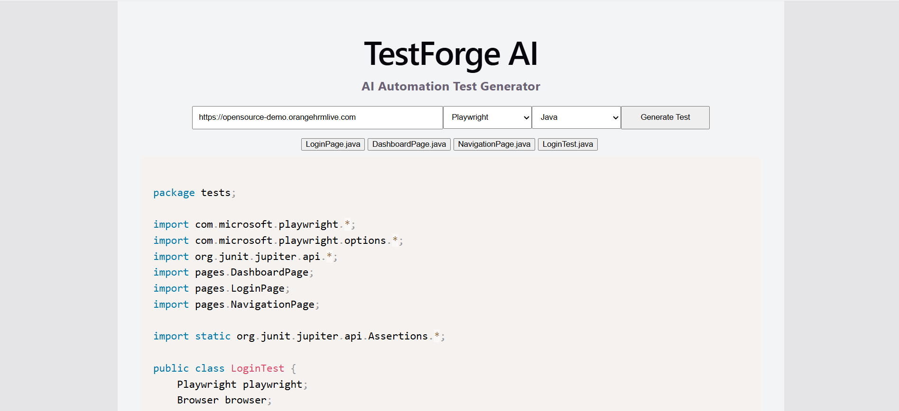

# TestForge AI


AI-powered automation test generator.

TestForge AI analyzes a webpage and automatically generates automation tests with different tools in multiple programming languages using Large Language Models.

The application demonstrates how AI can accelerate QA automation by generating runnable test scripts directly from a URL.

This project explores how AI can assist SDETs by automatically generating automation tests from real web applications.

---
# UI Preview

TestForge AI allows users to:

• Enter a website URL  
• Select an automation tool
• Select a programming language  
• Generate automation tests using AI

Example interface:



# Key Features

* AI-generated Playwright automation tests
* Page Object Model generation
* Dynamic webpage analysis using Playwright
* Multi-language test generation
* Modern React frontend interface
* Full stack architecture (React + Node + Express)

---

# Demo

User enters a URL: https://opensource-demo.orangehrmlive.com

User selects an automation tool: Playwright

User selects a programming language: Java

TestForge AI:

1. Loads the webpage using Playwright
2. Extracts the rendered DOM
3. Sends the page content and selected language to an LLM
4. Generates Playwright automation tests using the Page Object Model
5. Saves the generated test files to disk
6. Displays the generated code in the UI

Example output:

```
import { test, expect } from '@playwright/test'

test('login test', async ({ page }) => {

  await page.goto('https://opensource-demo.orangehrmlive.com')

  await page.fill('input[name="username"]', 'Admin')

  await page.fill('input[name="password"]', 'admin123')

  await page.click('button[type="submit"]')

  await expect(page.locator('h6')).toHaveText('Dashboard')

})
```
---

# Tech Stack

Frontend

* React
* Vite
* Axios

Backend

* Node.js
* Express
* Playwright
* OpenAI API

---

# Architecture

```
React Frontend
      ↓
Express API
      ↓
Playwright Scraper
      ↓
OpenAI Prompt Builder
      ↓
OpenAI API
      ↓
Generated Playwright Tests
```
---
# Request Flow

Frontend sends the following payload to the backend:

```json
{
  "url": "https://example.com",
  "language": "JavaScript"
}
```

The backend then:

1. Scrapes the page using Playwright
2. Extracts the DOM
3. Builds an AI prompt including the selected language
4. Sends the prompt to OpenAI
5. Returns generated test code to the frontend

---

# Project Structure

```
testforge-ai
│
├── backend
│   ├── src
│   │   ├── controllers
│   │   │   └── testController.js
│   │   │
│   │   ├── routes
│   │   │   └── testRoutes.js
│   │   │
│   │   ├── services
│   │   │   ├── aiService.js
│   │   │   └── scraperService.js
│   │   │
│   │   └── prompts
│   │       └── playwrightPrompt.js
│   │
│   └── generated-tests
│
├── frontend
│   ├── src
│   │   ├── components
│   │   │   ├── UrlInput.jsx
│   │   │   └── CodeViewer.jsx
│   │   │
│   │   └── services
│   │       └── api.js
│   │
│   └── index.html
│
├── .gitignore
└── README.md

```

---

# Running the Application

Backend

```
cd backend
npm install
npm run dev
```

Frontend

```
cd frontend
npm install
npm run dev
```

Open in browser:

```
http://localhost:5173
```

---

# Future Improvements

TestForge AI will evolve into an AI-powered QA automation platform capable of:

* Generate multiple Page Objects automatically
* Generate API automation tests
* Generating performance tests (k6)
* Generating full automation frameworks
* Add support for additional automation tools (Selenium, Cypress)
* AI-based locator healing
* AI-assisted test failure analysis

---

# Why This Project Exists

Automation engineers spend significant time writing repetitive test code.

TestForge AI explores how Large Language Models can assist automation engineers by automatically generating test scripts directly from real web applications.

The goal is to demonstrate how **AI-assisted developer tooling can accelerate QA automation workflows.**

---

# Author

## Chukwuma Anyadike

Automation Engineer specializing in:

* Test Automation Frameworks
* Playwright
* API Testing
* Performance Testing
* AI-assisted developer tooling
